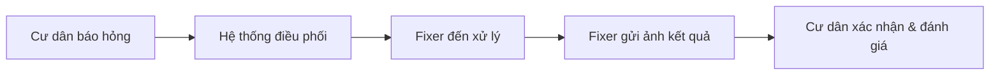

# C. Dịch vụ Hỗ trợ & Phản hồi (Support)

Chúng tôi luôn lắng nghe và hỗ trợ bạn 24/7 để đảm bảo môi trường sống tốt nhất.

## 1. Gửi yêu cầu Hỗ trợ (Ticketing System)
Khi có sự cố, bạn chỉ cần mở App và tạo yêu cầu:
- **Phân loại đa dạng**: Báo hỏng điện nước, yêu cầu dọn phòng, báo cáo tiếng ồn hoặc phản ánh an ninh.
- **Đính kèm trực quan**: Chụp ảnh hoặc quay video sự cố để kỹ thuật viên nắm bắt tình hình trước khi đến.
- **Theo dõi thời gian thực**:
    - **Vàng**: Đã tiếp nhận.
    - **Cam**: Nhân viên đang trên đường đến.
    - **Xanh**: Đã xử lý xong.

## 2. Quy trình Xử lý Sự cố

Mỗi yêu cầu đều có mức độ ưu tiên. Các sự cố khẩn cấp (chập điện, rò rỉ nước, báo cháy) sẽ được hệ thống đẩy lên ưu tiên số 1.

## 3. Khảo sát & Đánh giá chất lượng
Sau mỗi lần nhân viên hoàn thành công việc, bạn có quyền:
- **Chấm sao**: Từ 1 đến 5 sao dựa trên thái độ và chất lượng sửa chữa.
- **Để lại nhận xét**: Giúp ban quản lý cải thiện dịch vụ tốt hơn. 
- *Lưu ý*: Nhân viên có điểm đánh giá thấp liên tục sẽ bị hệ thống cảnh báo và thay thế.

## 4. Tham gia Cộng đồng
- **Bình chọn**: Tham khảo ý kiến cư dân về các hoạt động chung của tòa nhà (ví dụ: tổ chức Trung thu, trang trí Noel).
- **Khiếu nại bảo mật**: Gửi các ý kiến đóng góp kín cho ban quản lý để xử lý các vấn đề nhạy cảm mà không lộ danh tính với cư dân khác.
